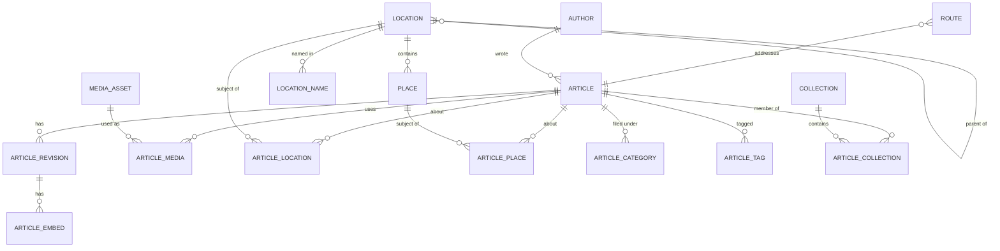

# Data model

Data describes meaning, never presentation. No table stores a component name, a
CSS class or a rendered fragment.

## Article

Identity and lifecycle only — no title, no body.

- `kind` — `article` (listed, syndicated) or `page` (about, FAQ, legal).
- `status` — `draft` | `scheduled` | `published` | `archived`.
- `currentRevisionId` — what the editor is working on.
- `publishedRevisionId` — what the public site renders.

Saving in the admin never changes the live page: publishing swaps the pointer.

## ArticleRevision

Immutable. Editing creates revision _n+1_; the published snapshot is untouched.
`bodyMarkdown` is the canonical body — never HTML, never MDX
([ADR 0001](adr/0001-markdown-canonical-content.md)).

## ArticleEmbed

Structured content Markdown cannot express (cost tables, maps, notices),
referenced from the body as `{{embed:anchor-key}}`. The payload says _what_ the
thing is; which component renders it is a frontend decision.

## Location / LocationName

One table for every geographic level (`continent` … `district`), nested through
`parentId`. Names live in `location_names`, one row per locale, so adding a
language never touches `locations`.

## Place

Shops, hotels, airports and attractions, attached to a location. Feeds
schema.org `Place` types and place-based related articles.

## Route

`path`, `targetType`, `targetId`, `isCanonical`, `redirectTo`, `noindex`.
Article URLs are frozen from the previous site; every other URL that moved kept
a 301 in this table.

## MediaAsset / ArticleMedia

The asset stores bytes and intrinsic size. Alt text and caption live on the
_usage_, because the same photo describes something different in each article.
Derived formats (AVIF, thumbnails) are rebuildable and are not stored.

## AIArtifact

Sidecar output attached to an entity and the revision it was derived from.
Never a source of truth ([ADR 0004](adr/0004-ai-artifacts-non-canonical.md)).
