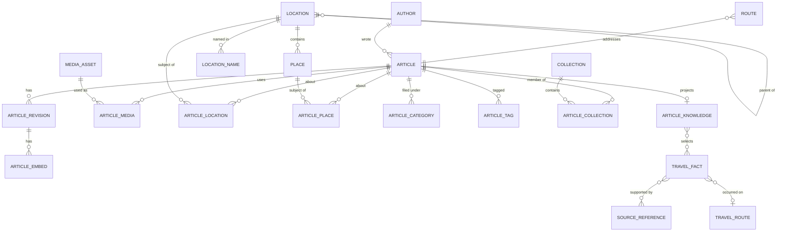

# Data model

Data describes meaning, never presentation. No table stores a component name, a
CSS class or a rendered fragment.

## Article

Identity and lifecycle only — no title, no body.

- `kind` — `article` (listed, syndicated) or `page` (about, FAQ, legal).
- `status` — `draft` | `scheduled` | `published` | `archived`.
- `currentRevisionId` — what the editor is working on.
- `publishedRevisionId` — what the public site renders.

Saving in the admin never changes the live page: publishing swaps the pointer.

## ArticleRevision

Immutable. Editing creates revision _n+1_; the published snapshot is untouched.
`bodyMarkdown` is the canonical body — never HTML, never MDX
([ADR 0001](adr/0001-markdown-canonical-content.md)).

## ArticleEmbed

Structured content Markdown cannot express (cost tables, maps, notices),
referenced from the body as `{{embed:anchor-key}}`. The payload says _what_ the
thing is; which component renders it is a frontend decision.

## Location / LocationName

One table for every geographic level (`continent` … `district`), nested through
`parentId`. Names live in `location_names`, one row per locale, so adding a
language never touches `locations`.

## Place

Shops, hotels, airports and attractions, attached to a location. Feeds
schema.org `Place` types and place-based related articles.

## Route

`path`, `targetType`, `targetId`, `isCanonical`, `redirectTo`, `noindex`.
Article URLs are frozen from the previous site; every other URL that moved kept
a 301 in this table.

## MediaAsset / ArticleMedia

The asset stores bytes and intrinsic size. Alt text and caption live on the
_usage_, because the same photo describes something different in each article.
Derived formats are rebuildable and are not stored: `pnpm media:build`
regenerates the AVIF/WebP ladder from the originals in `media/`.

## ContactMessage

Contact form submissions. The sender's address is stored as a salted hash and
never in the clear: enough to rate-limit a sender, not enough to identify one
afterwards.

## AIArtifact

Sidecar output attached to an entity and the revision it was derived from.
Never a source of truth ([ADR 0004](adr/0004-ai-artifacts-non-canonical.md)).

## Travel knowledge and provenance

`TravelFact` is a reusable claim, not a loose string in frontmatter. It carries a
kind, verification state, provenance, time, optional typed value, volatility and
stable references to articles, places, sources and a travel route.

Provenance has four meanings:

- `firsthand` — Tomokichi personally experienced it; `experiencedAt` is required;
- `official` — checked against an official source; source and `verifiedAt` required;
- `researched` — supported by a non-official external source;
- `derived` — recommendation or inference based on other information.

AI may create `candidate` facts. A `firsthand` fact can become `verified` only via
`verifyFirsthandCandidate`, which requires a human author identity. This invariant
is also checked against the full exported graph by `pnpm check:knowledge`.

`TravelRoute` is an experienced transport/walking route. It is intentionally
separate from the existing `Route`, which owns public URLs.

`ArticleKnowledge` selects facts and routes for one immutable article revision and
adds editorial structures such as Quick Answer and a decision table. Publishing a
new revision can therefore keep the old live knowledge projection stable until its
matching knowledge record is ready.

## Persistence and migration

Migration `0008_travel_knowledge.sql` adds portable relational identity and small
JSON value-object columns. The public build snapshot is versioned by
`ArticleKnowledge.schemaVersion`; incompatible changes require an append-only D1
migration and an explicit snapshot migration. Existing Markdown remains valid, so
articles can move incrementally rather than through a destructive rewrite.

The first migrated slice covers Mirador del Valle, CHAGEE menu explanations and
Aswan → Abu Simbel. Facts not evidenced by the existing articles or owner-provided
architecture notes were deliberately not invented.
